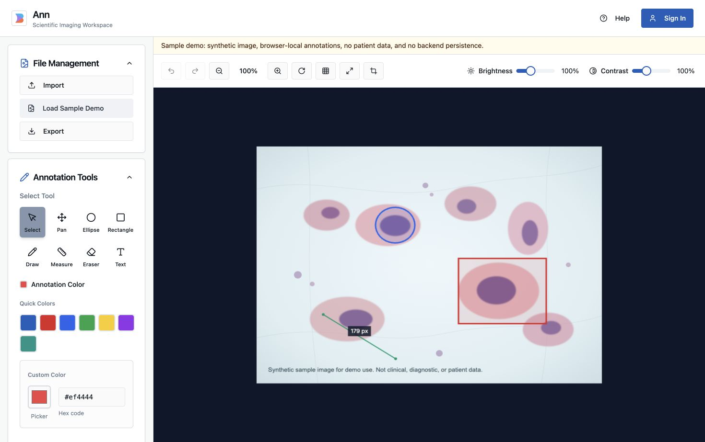

# CellAnnotation

CellAnnotation is a web app for viewing microscopy-style images and creating region, cell, text, and measurement annotations. It is intended as an image-annotation workspace and portfolio project, not diagnostic or clinically validated software.

## Demo

The frontend includes a self-contained sample workflow:

1. Start the app locally.
2. Open `/workspace?demo=sample`, or click **Try Sample Demo** on the landing page.
3. Edit the seeded annotations, create a new annotation, export JSON annotations, or export a composite image.

The sample image is synthetic and included in this repository at `frontend/public/demo/sample-cells.svg`. Demo edits are stored in the browser only and are not persisted to the backend.

## Screenshots



## What Works

- Uploads common image formats through the FastAPI backend: PNG, JPG/JPEG, TIF/TIFF, and SVS.
- Generates thumbnails for standard image files.
- Generates SVS thumbnails with OpenSlide and Deep Zoom tiles with libvips when those native dependencies are available.
- Displays standard images in the canvas viewer with zoom, pan, rotate, brightness, contrast, grid overlay, and export controls.
- Displays SVS Deep Zoom images through OpenSeadragon when the backend returns a DZI tile URL.
- Creates rectangle, ellipse, freehand, text, and measurement annotations.
- Supports layer visibility, annotation selection, basic editing, undo/redo, deletion, JSON annotation import/export, mask export, and composite image export.
- Provides registration, login, JWT-based sessions, password change, and admin user-management endpoints.

## Known Limitations

- Annotation persistence is browser-local for the current frontend workflow. Uploaded image files are stored by the backend, but annotations are saved in `localStorage` unless exported manually.
- Authentication exists, but uploaded files and file download endpoints are not scoped to individual users yet. Do not use this deployment for private research data or patient data.
- Public demo mode uses a static synthetic image and local browser storage. It intentionally differs from a production multi-user annotation system.
- SVS support depends on OpenSlide and libvips on the backend host. If either is unavailable, SVS thumbnailing or tiling will fail with an explicit backend error.
- The current pinned backend dependencies install and test under Python 3.12. Python 3.14 is not supported by the pinned `pydantic-core` build at the time this README was updated.
- The frontend production build currently emits a Vite chunk-size warning for the main workspace bundle. The build succeeds, but future work should split the image viewer bundle.
- The backend `flake8` command reports existing style issues, mostly line length and import-order concerns. Backend tests and Black formatting checks pass.

## Architecture

- `frontend/` - React 18, TypeScript, Vite, Tailwind CSS, Radix UI components, Vitest.
- `backend/` - FastAPI, Pydantic, SQLAlchemy, SQLite, Pillow, OpenSlide, libvips-backed SVS tiling, Pytest.
- `render.yaml` and `backend/Dockerfile` - Render-oriented backend deployment configuration.

The frontend can be hosted as static assets. The backend needs a stateful Python host with persistent storage for uploaded images, generated thumbnails, SQLite data, logs, and SVS tiles.

## Local Setup

Use Python 3.12 for the backend.

```bash
git clone https://github.com/eppm27/CellAnnotation.git
cd CellAnnotation
/opt/homebrew/bin/python3.12 -m venv .venv
source .venv/bin/activate
cd backend
pip install -r requirements.txt
```

Install frontend dependencies:

```bash
cd ../frontend
npm install
```

For SVS files, install native image-processing tools:

```bash
# macOS
brew install openslide vips

# Ubuntu/Debian
sudo apt-get update
sudo apt-get install -y libopenslide0 openslide-tools libvips42 libvips-tools
```

## Run Locally

Start the backend:

```bash
cd backend
source ../.venv/bin/activate
uvicorn app.main:app --reload --port 5001
```

Start the frontend in another terminal:

```bash
cd frontend
npm run dev
```

Open `http://localhost:5173/` for the landing page or `http://localhost:5173/workspace?demo=sample` for the sample annotation workflow.

## Environment Variables

Frontend:

- `VITE_API_BASE_URL` - backend origin for deployed/prod frontend builds, for example `https://cell-annotation-api.example.com`.

Backend:

- `ANN_ENV` - set to `production` in production.
- `ANN_APP_DATA_DIR` - persistent directory for SQLite, uploads, thumbnails, and tiles.
- `ANN_LOGS_DIR` - persistent logs directory.
- `ANN_TILES_DIR` - optional tile output directory. Defaults to `${ANN_APP_DATA_DIR}/tiles`.
- `ANN_SECRET_KEY` - required in production.
- `ANN_JWT_SECRET_KEY` - required in production.
- `ANN_CORS_ORIGINS` - comma-separated allowed frontend origins. Required in production.
- `ANN_ENABLE_DEV_SEED` - set to `false` in production.
- `VIP_BIN` - optional explicit path to the `vips` binary.

## Testing

Frontend:

```bash
cd frontend
npm run typecheck
npm run test
npm run build
```

Backend:

```bash
cd backend
source ../.venv/bin/activate
pytest
black --check app tests
```

Optional backend style check:

```bash
flake8 app tests
```

At the time of this update, `flake8` reports existing style issues, while `pytest` and `black --check` pass.

## Deployment

Recommended portfolio deployment:

1. Deploy `frontend/` to Vercel or another static frontend host.
2. Deploy `backend/` separately on Render, Fly.io, Railway, or another Python host that supports persistent disks and native packages.
3. Set `VITE_API_BASE_URL` on the frontend to the public backend origin.
4. Set production backend secrets and CORS origins.
5. Attach persistent storage for `ANN_APP_DATA_DIR`.

The repository includes `render.yaml` and `backend/Dockerfile` for a Render backend service. The Render blueprint expects a persistent disk mounted at `/var/data` and installs `libvips` and OpenSlide in the Docker image.

Do not deploy only to Vercel and expect uploads, authentication, SQLite persistence, or SVS processing to work. Vercel is suitable for the static frontend, not this Python image-processing backend.

## Project Origin And Attribution

This project was created collaboratively by:

- Gregorius Andrew Winata
- Byron Quintuna
- Ellis Mon
- Jiakun Li
- Enyuan Zhang

Portfolio polishing work in this branch focuses on making the existing product easier to evaluate: a self-contained sample workflow, clearer demo labeling, safer deletion flow, stronger documentation, and additional frontend test coverage for the sample workspace. It does not claim clinical validation, production authorization controls, or AI-powered analysis.

## Legacy Desktop Packaging

The repository also contains older local packaging scripts in `build.local.sh`, `build.local.ps1`, and `MacFile/`. These were not part of the current web-demo verification pass.
